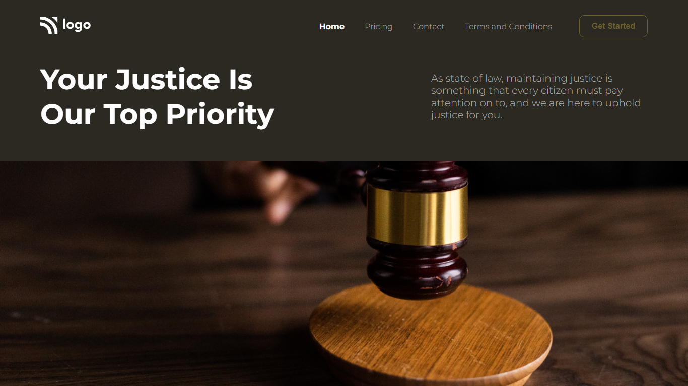

# Project 3 - Legal Services Landing Page

  

 

[DEPLOYED WEBSITE LINK](https://fsbproject3.netlify.app/)

## What I learned from this Project?

- I learned how to adjust background image with background color.
- Also button and font css.

## Completed the project in **1 hour and 30 minutes**.